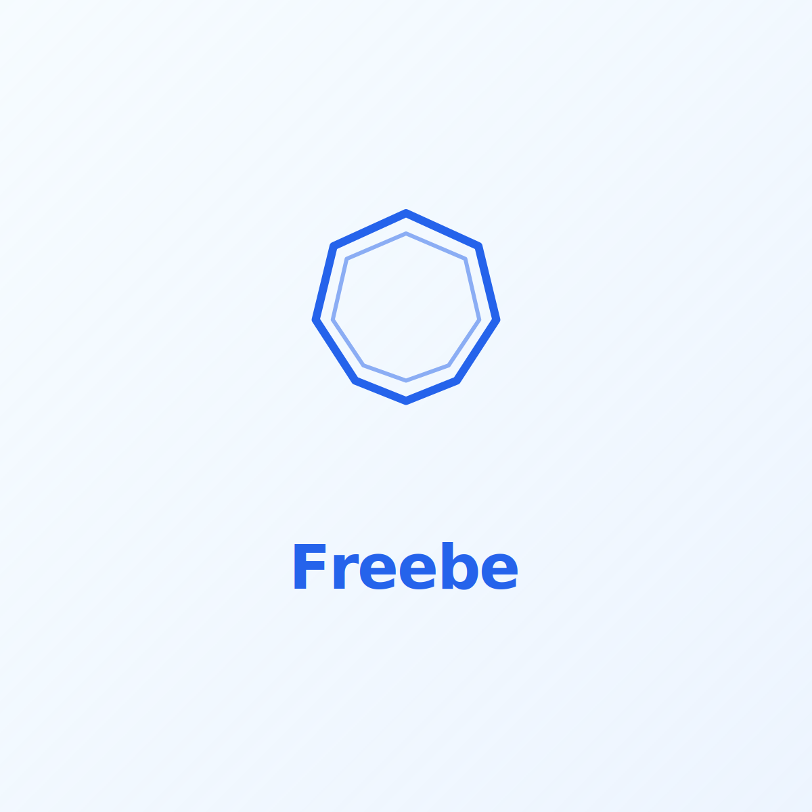

  

---

## Table of Contents

- [Freebe AI](#freebe-ai)
- [What’s Live Today](#whats-live-today)
- [Freebe Chat](#freebe-chat)
- [90-Day Roadmap](#90-day-roadmap)
- [Partnership API (High-Level)](#partnership-api-high-level)
- [What This Repository Is (and Is Not)](#what-this-repository-is-and-is-not)
- [Partnerships](#partnerships)
- [Ownership & Contact](#ownership--contact)
- [License](#license)

---

# Freebe AI

Freebe is an independent AI project focused on building practical, accessible AI systems that operate in real environments — not demos, sandboxes, or locked platforms.

The project is designed for individuals and small teams working directly with AI: experimenting, learning, and shipping systems that must be correct, cost-aware, and maintainable over time.

Freebe prioritizes clarity, transparency, and operational discipline over scale, hype, or speculative claims.

---

## What’s Live Today

The following components are live and operational:

- **Freebe Chat** — a public AI interface for thinking, search, and creative work  
- **Production backend infrastructure** built on Supabase (auth, database, edge functions)
- **Multi-provider AI routing** with cost and capability boundaries enforced server-side
- **Caching and performance controls** to prevent runaway inference costs
- **Security hardening and audit passes** across backend services
- **Public website**: https://www.freebeai.com

This repository intentionally does **not** expose implementation details, credentials, or infrastructure code.

---

## Freebe Chat

Freebe Chat is the public-facing AI interface of the Freebe project.

It is a free AI workspace that allows users to think, search, and create in one place. Freebe Chat combines conversational AI, web search, and image generation in a simple, open environment intended for everyday use.

Freebe Chat is intentionally lightweight and accessible. It is **not** a developer platform, automation suite, or agent framework. It exists as a public expression of Freebe’s underlying AI systems and operational philosophy.

---

## 90-Day Roadmap

The next 90 days are focused on leverage and stability, not feature sprawl:

- Expand internal AI routing logic for additional providers
- Improve usage metering and cost attribution
- Harden abuse prevention and rate-limiting
- Improve system observability and failure reporting
- Refine partnership intake and evaluation workflow
- Incremental UI improvements based on real usage
- Documentation upgrades for partners and collaborators

No speculative features. No hype-driven milestones.

---

## Partnership API (High-Level)

Freebe supports **API-based partnerships only**.

### What Freebe Needs from Partners
- API keys or authenticated endpoints
- Clear usage limits and pricing model (or free tier terms)
- Permission to route real user traffic for evaluation
- Optional attribution or branding requirements

### What Freebe Provides
- Real-world usage surface (not benchmarks or demos)
- Structured routing and request normalization
- Usage feedback and qualitative performance insights
- Attribution where appropriate
- No hosting, resale, or model redistribution

Freebe does **not** host models, rent GPUs, or resell compute.

---

## What This Repository Is (and Is Not)

### This repository **is**:
- A public reference for Freebe AI
- High-level documentation and positioning
- A partnership and evaluation entry point
- Brand and project overview

### This repository **is not**:
- Application source code
- Backend infrastructure
- Model implementations
- API keys, secrets, or configuration
- A contribution-based open-source project

All production systems operate separately from this repository.

---

## Partnerships

Freebe collaborates with independent AI developers and small teams who want real-world usage and feedback.

Partnerships are practical, limited-scope, and API-driven. The goal is mutual validation and learning — not enterprise contracts or marketing partnerships.

For partnership inquiries:  
**fusion@freebeai.com**

---

## Ownership & Contact

Freebe is a project owned and operated by **Axiopistis Holdings LC**.

General inquiries:  
**hello@freebeai.com**

Legal and compliance matters:  
**legal@axiopistisholdings.com**

Website: https://www.freebeai.com

---

## License

This repository and all of its contents are proprietary.

**Copyright © 2025 Axiopistis Holdings LC. All rights reserved.**

Unauthorized copying, distribution, modification, or use of this repository or any of its contents is strictly prohibited.  
See the [LICENSE](LICENSE) file for full terms and conditions.

“Freebe AI,” “Freebe,” and all associated branding are trademarks of Axiopistis Holdings LC.
